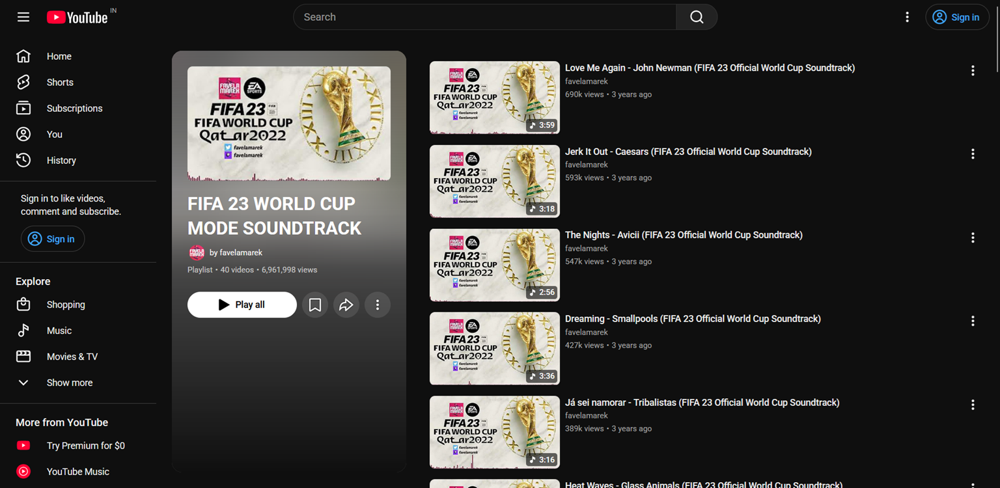

  

  <h1>YouTube Playlist Numbers</h1>

  
<b>Restores precise index numbers for videos on YouTube's redesigned playlist pages.</b>

  

    
    
  

  

    <a href="#-quick-installation"><b>📥 Install Userscript</b></a> •
    <a href="#-features"><b>✨ Features</b></a> •
    <a href="#-screenshots"><b>📸 Screenshots</b></a> •
    <a href="#-compatibility"><b>🌐 Compatibility</b></a>
  

---

## 💡 Why Use This?

YouTube's modern UI update removed the numerical position indicators from playlist pages. Without video numbers, it becomes difficult to:

- 📌 **Track your progress** in large educational courses or video series.
- 🎯 **Reference specific videos** by position when sharing with others.
- 🎵 **Navigate long music or podcast collections** with ease.

**YouTube Playlist Numbers** fixes this by seamlessly injecting native index numbers beside each item.

---

## ✨ Features

- 🔢 **Restores Playlist Indexing:** Re-adds `#1`, `#2`, `#3` labels directly next to video titles.
- ⚡ **Dynamic SPA Support:** Automatically indexes newly loaded videos as you scroll.
- 🎨 **Native Theme Integration:** Blends seamlessly into YouTube's Light and Dark themes.
- 🔒 **Privacy-First & Lightweight:** Zero external dependencies, no API calls, and no tracking.

---

## 📸 Screenshots

| Before (Default YouTube) | After (With Userscript) |
| :---: | :---: |
|  |  |

---

## 🚀 Quick Installation

> [!NOTE]
> You need a userscript manager extension installed in your browser before adding this script.

### Step 1: Install a Userscript Manager

| Browser | Recommended Manager |
| :--- | :--- |
| **Chrome / Brave / Edge / Opera** | [Violentmonkey](https://violentmonkey.github.io/) (*Recommended*) or [Tampermonkey](https://www.tampermonkey.net/) |
| **Firefox** | [Violentmonkey](https://violentmonkey.github.io/) or [Greasemonkey](https://www.greasespot.net/) |
| **Safari** | [Userscripts for Safari](https://github.com/quoid/userscripts) |

### Step 2: Install the Script

Click the button below to install directly:

  

---

## 🛠️ How It Works

1. **URL & DOM Detection:** Identifies when you are viewing a YouTube playlist page (`/playlist?list=...`).
2. **Mutation Observer:** Watches for modern YouTube Single Page Application (SPA) DOM changes.
3. **Non-Intrusive Injections:** Prepends sequential numbers without altering YouTube's native layout or CSS styles.

---

## 🌐 Compatibility

### Supported Browsers
- ✅ **Google Chrome / Chromium**
- ✅ **Mozilla Firefox**
- ✅ **Microsoft Edge**
- ✅ **Waterfox**
- ✅ **Floorp**

### Supported Userscript Engines
- ✅ **Violentmonkey** *(Fully tested & recommended)*
- ✅ **Tampermonkey**
- ✅ **Greasemonkey**

---

🙏 Acknowledgements
-------------------

<a href="https://www.flaticon.com/free-icons/youtube-playlist" title="youtube playlist icons">Youtube playlist icons created by kawalanicon - Flaticon</a>

---

📜 License
----------

Distributed under the **MIT License**. See [`LICENSE`](https://www.google.com/search?q=LICENSE) for details.

---

---

Made with ❤️ for the YouTube community.

